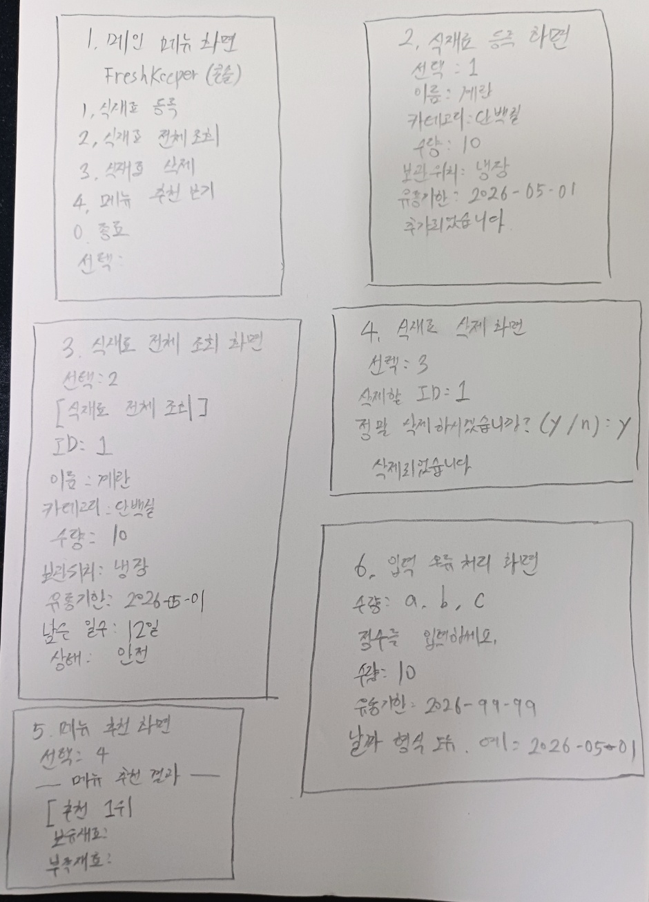

# 2. 요구사항 분석 및 설계

## 1. 요구사항

FreshKeeper는 사용자가 직접 입력한 냉장고 식재료 정보를 관리하고, 유통기한 기반 소비를 돕는 것을 목표로 한다. 
사용자는 식재료를 등록하고, 전체 목록을 조회하며, 유통기한 상태를 확인할 수 있다. 또한 보유 중인 식재료를 기반으로 만들 수 있는 메뉴를 추천받을 수 있다.

---

## 1.1 기능적 요구사항

| ID | 기능적 요구사항 | 설명 | 우선순위 |
|---|---|---|---|
| F-01 | 식재료 등록 | 사용자는 식재료의 이름, 카테고리, 수량, 보관 위치, 유통기한을 입력하여 식재료를 등록할 수 있다. | 높음 |
| F-02 | 식재료 전체 조회 | 사용자는 등록된 식재료 목록을 확인할 수 있다. | 높음 |
| F-03 | 식재료 삭제 | 사용자는 식재료 ID를 입력하여 등록된 식재료를 삭제할 수 있다. | 중간 |
| F-04 | 유통기한 남은 날짜 계산 | 프로그램은 현재 날짜를 기준으로 유통기한까지 남은 일수를 계산한다. | 높음 |
| F-05 | 유통기한 상태 분류 | 남은 날짜에 따라 식재료 상태를 안전, 주의, 위험, 오늘까지, 만료로 분류한다. | 높음 |
| F-06 | 메뉴 추천 | 등록된 식재료와 레시피 데이터를 비교하여 만들 수 있는 메뉴를 추천한다. | 높음 |
| F-07 | 부족 재료 표시 | 추천 메뉴에 필요한 재료 중 현재 보유하지 않은 재료를 부족 재료로 표시한다. | 중간 |
| F-08 | 잘못된 입력 처리 | 수량에 문자를 입력하거나 날짜 형식을 잘못 입력해도 프로그램이 종료되지 않고 다시 입력받는다. | 높음 |
| F-09 | 데이터 저장 및 불러오기 | 프로그램 종료 후에도 식재료 데이터가 유지되도록 파일 저장 및 불러오기 기능을 제공한다. | 중간 |

---

## 1.2 비기능적 요구사항

| ID | 비기능적 요구사항 | 설명 |
|---|---|---|
| NF-01 | 사용성 | 콘솔 기반 메뉴를 직관적으로 구성하여 사용자가 쉽게 기능을 선택할 수 있어야 한다. |
| NF-02 | 안정성 | 잘못된 입력이 들어와도 프로그램이 갑자기 종료되지 않도록 예외 처리를 수행해야 한다. |
| NF-03 | 유지보수성 | 기능별로 클래스를 분리하여 코드 수정과 확장이 용이해야 한다. |
| NF-04 | 성능 | 일반적인 식재료 데이터 범위에서는 지연 없이 빠르게 동작해야 한다. |
| NF-05 | 데이터 지속성 | 프로그램을 종료한 후에도 식재료 정보가 유지될 수 있도록 저장 기능을 제공해야 한다. |
| NF-06 | 확장성 | 추후 검색, 수정, 알림, GUI, 데이터베이스 연동 등의 기능을 추가할 수 있도록 구조를 단순하고 명확하게 설계해야 한다. |
| NF-07 | 가독성 | 변수명, 메소드명, 클래스명을 역할에 맞게 작성하여 코드 이해가 쉬워야 한다. |

---

## 1.3 요구사항 정리

본 프로젝트의 핵심 요구사항은 사용자가 직접 식재료 정보를 등록하고, 등록된 식재료의 유통기한 상태를 쉽게 확인할 수 있도록 하는 것이다. 
또한 보유 식재료를 기반으로 메뉴를 추천함으로써 식재료 활용도를 높이고 음식물 낭비를 줄이는 데 목적이 있다.

다만 본 프로젝트는 실제 냉장고 내부 자동 스캔, 바코드 인식, 이미지 인식, IoT 센서 연동, 외부 API 연동은 포함하지 않는다. 
이러한 기능은 프로젝트 범위를 초과하므로 제외하고, Java 콘솔 프로그램에서 구현 가능한 기능에 집중하였다.

## 시스템 설계
## 2. 전체 프로젝트 개요 다이어그램
FreshKeeper는 사용자가 직접 식재료 정보를 입력하면, 프로그램이 식재료를 관리하고 유통기한을 계산한 뒤 메뉴를 추천하는 구조이다.

### 전체 흐름

| 단계 | 담당 요소 | 역할 |
|---|---|---|
| 1 | 사용자 | 메뉴 선택, 식재료 정보 입력 |
| 2 | Main.java | 콘솔 메뉴 출력, 사용자 입력 처리 |
| 3 | FoodService.java | 식재료 등록, 전체 조회, 삭제 처리 |
| 4 | Food.java | 식재료 정보 저장, 유통기한 계산, 상태 분류 |
| 5 | RecipeService.java | 보유 재료와 레시피 비교, 메뉴 추천 |
| 6 | Recipe.java | 메뉴 이름과 필요한 재료 목록 저장 |
| 7 | RecipeResult.java | 추천 결과, 부족 재료, 추천 점수 저장 |

### 처리 구조

| 흐름 | 설명 |
|---|---|
| 사용자 → Main.java | 사용자가 메뉴 번호를 선택하고 식재료 정보를 입력한다. |
| Main.java → FoodService.java | 식재료 등록, 조회, 삭제 요청을 전달한다. |
| FoodService.java → Food.java | 식재료 객체를 생성하고 목록으로 관리한다. |
| Main.java → RecipeService.java | 메뉴 추천 요청을 전달한다. |
| RecipeService.java → Recipe.java | 등록된 레시피와 보유 식재료를 비교한다. |
| RecipeService.java → RecipeResult.java | 추천 메뉴, 보유 재료, 부족 재료, 점수를 결과로 저장한다. |

---

## 3. 자바 클래스 다이어그램

본 프로젝트는 기능별로 클래스를 분리하여 유지보수하기 쉽게 구성하였다.

| 클래스명 | 구분 | 주요 역할 |
|---|---|---|
| Main.java | 실행 클래스 | 프로그램 시작, 메뉴 출력, 사용자 입력 처리 |
| Food.java | 모델 클래스 | 식재료 정보 저장, 유통기한 계산, 상태 분류 |
| FoodService.java | 서비스 클래스 | 식재료 등록, 조회, 삭제 기능 처리 |
| Recipe.java | 모델 클래스 | 레시피 이름과 필요한 재료 목록 저장 |
| RecipeService.java | 서비스 클래스 | 보유 재료 기반 메뉴 추천, 추천 점수 계산 |
| RecipeResult.java | 결과 클래스 | 추천 결과, 보유 재료, 부족 재료, 점수 저장 |

### 클래스 관계

| 관계 | 설명 |
|---|---|
| Main → FoodService | Main이 식재료 관리 기능을 호출한다. |
| Main → RecipeService | Main이 메뉴 추천 기능을 호출한다. |
| FoodService → Food | FoodService가 Food 객체 목록을 관리한다. |
| RecipeService → Recipe | RecipeService가 레시피 목록을 사용한다. |
| RecipeService → RecipeResult | RecipeService가 추천 결과 객체를 생성한다. |

---

## 4. 데이터베이스 이용 시 필요한 필드 이름 정리

본 프로젝트는 현재 별도의 데이터베이스를 사용하지 않고 Java의 ArrayList로 데이터를 관리한다.  
다만 추후 데이터베이스 또는 CSV 파일 저장 기능으로 확장할 경우 아래 필드를 사용할 수 있다.

| 구분 | 필드명 | 자료형 | 설명 |
|---|---|---|---|
| 저장 필드 | id | long | 식재료 고유 번호 |
| 저장 필드 | name | String | 식재료 이름 |
| 저장 필드 | category | String | 식재료 분류 |
| 저장 필드 | quantity | int | 식재료 수량 |
| 저장 필드 | storageLocation | String | 보관 위치 |
| 저장 필드 | expiryDate | LocalDate | 유통기한 |
| 계산 필드 | daysLeft | long | 현재 날짜 기준 남은 일수 |
| 계산 필드 | status | String | 안전, 주의, 위험, 오늘까지, 만료 상태 |

---

## 5. 화면 설계

FreshKeeper는 콘솔 기반 프로그램이므로 사용자는 메뉴 번호를 입력하여 원하는 기능을 선택한다.

| 화면 | 출력 내용 | 사용자 입력 |
|---|---|---|
| 메인 메뉴 화면 | 식재료 등록, 전체 조회, 삭제, 메뉴 추천, 종료 메뉴 출력 | 메뉴 번호 입력 |
| 식재료 등록 화면 | 이름, 카테고리, 수량, 보관 위치, 유통기한 입력 안내 | 식재료 정보 입력 |
| 식재료 전체 조회 화면 | 등록된 식재료의 이름, 수량, 유통기한, 남은 일수, 상태 출력 | 메뉴 번호 입력 |
| 식재료 삭제 화면 | 삭제할 식재료 ID 입력 안내 및 삭제 확인 | ID, y/n 입력 |
| 메뉴 추천 화면 | 추천 메뉴, 보유 재료, 부족 재료, 추천 점수 출력 | 메뉴 번호 입력 |
| 입력 오류 처리 화면 | 잘못된 수량 또는 날짜 형식 오류 안내 | 올바른 값 재입력 |

### 메인 메뉴 구성

| 번호 | 기능 |
|---|---|
| 1 | 식재료 등록 |
| 2 | 식재료 전체 조회 |
| 3 | 식재료 삭제 |
| 4 | 메뉴 추천 보기 |
| 0 | 종료 |

### 식재료 등록 화면 구성

| 입력 항목 | 예시 |
|---|---|
| 이름 | 계란 |
| 카테고리 | 단백질 |
| 수량 | 10 |
| 보관 위치 | 냉장 |
| 유통기한 | 2026-05-10 |

### 식재료 전체 조회 화면 구성

| 출력 항목 | 설명 |
|---|---|
| ID | 식재료 고유 번호 |
| 이름 | 식재료명 |
| 카테고리 | 식재료 분류 |
| 수량 | 보유 수량 |
| 보관 위치 | 냉장, 냉동, 실온 등 |
| 유통기한 | 입력한 유통기한 |
| 남은 일수 | 현재 날짜 기준 남은 날짜 |
| 상태 | 안전, 주의, 위험, 오늘까지, 만료 |

### 메뉴 추천 화면 구성

| 출력 항목 | 설명 |
|---|---|
| 추천 순위 | 점수 기준으로 정렬된 메뉴 순위 |
| 메뉴명 | 추천된 음식 이름 |
| 보유 재료 | 현재 가지고 있는 재료 |
| 부족 재료 | 레시피에 필요하지만 없는 재료 |
| 추천 점수 | 보유 재료와 부족 재료를 기준으로 계산된 점수 |
