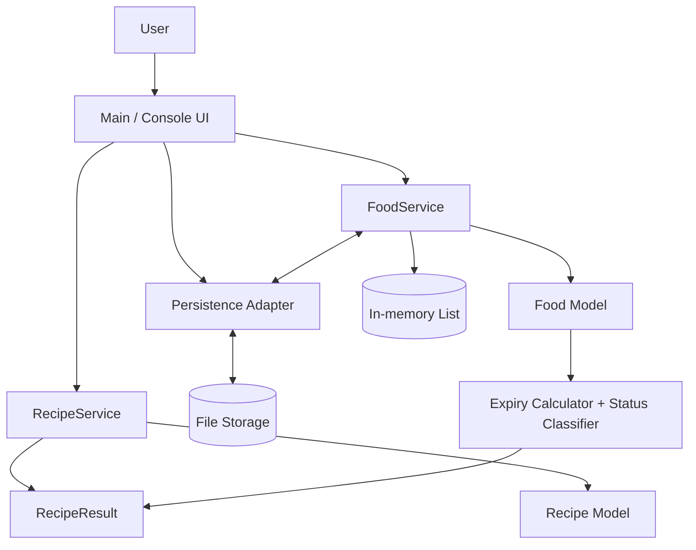

# 3. 프로젝트 구조 및 역할분담 · 일정관리

## 1. 문서 목적 및 범위
본 문서는 **2주차 산출물(요구사항 분석 및 설계)**을 기반으로 FreshKeeper의 구조를 구현 관점으로 재정의하고, 팀 운영 방식과 **주차별 일정**(마일스톤/점검 기준 포함)을 명확히 제시한다.

- **대상**: 담당 교수님, 팀원, 코드 리뷰어
- **범위**: 기능/화면/시스템 구조, 역할 분담, 협업 체계, 일정 및 리스크 대응
- **기준 문서**: `docs\2_요구사항_분석_및_설계\README.md`

---

## 2. 프로젝트 구조 설계

## 2.1 요구사항-기능-모듈 매핑 (Traceability)
요구사항이 어떤 코드 모듈에서 구현되는지 추적 가능하도록 매핑한다.

| 요구사항 ID | 요구사항 요약 | 기능 단위 | 담당 모듈/클래스 | 완료 판정 기준 |
|---|---|---|---|---|
| F-01 | 식재료 등록 | 등록 입력/검증/저장 | `Main`, `FoodService`, `Food` | 정상 입력 시 목록에 즉시 반영 |
| F-02 | 전체 조회 | 목록 출력/정렬 | `FoodService`, `Main` | 등록된 모든 항목이 누락 없이 출력 |
| F-03 | 식재료 삭제 | ID 기반 삭제/확인 | `FoodService`, `Main` | 존재 ID 삭제 성공, 미존재 ID 안내 |
| F-04 | 남은 날짜 계산 | 날짜 차이 계산 | `Food` | 오늘 기준 일수 계산 정확 |
| F-05 | 상태 분류 | 안전/주의/위험/오늘까지/만료 | `Food` | 상태 규칙대로 일관 분류 |
| F-06 | 메뉴 추천 | 레시피 매칭/점수화 | `RecipeService`, `Recipe` | 보유 재료 기반 추천 목록 생성 |
| F-07 | 부족 재료 표시 | 미보유 재료 추출 | `RecipeService`, `RecipeResult` | 추천 결과에 부족 재료 포함 |
| F-08 | 잘못된 입력 처리 | 예외/재입력 유도 | `Main` | 프로그램 비정상 종료 없이 재입력 |
| F-09 | 저장/불러오기 | 파일 I/O 지속성 | 저장 모듈 + `FoodService` | 재실행 후 이전 데이터 복원 |

## 2.2 기능 분해 구조 (Functional Decomposition)

| 상위 기능 | 하위 기능 | 입출력 | 선행 조건 | 비고 |
|---|---|---|---|---|
| 식재료 관리 | 등록/조회/삭제 | 입력값 ↔ 목록 데이터 | 프로그램 실행 | 핵심 사용자 플로우 |
| 유통기한 관리 | 날짜 계산/상태 라벨링 | 유통기한 → 남은 일수/상태 | 유효 날짜 입력 | 조회/추천의 공통 기반 |
| 추천 엔진 | 보유재료 매칭/부족재료 계산 | 목록 + 레시피 → 추천 결과 | 재료 1개 이상 | 점수 기반 정렬 |
| 안정성 | 입력 검증/예외 처리 | 잘못된 입력 → 재시도 | 없음 | 사용자 경험 품질 |
| 데이터 지속성 | 저장/불러오기 | 메모리 ↔ 파일 | 저장 포맷 일치 | 3주차 안정화 핵심 |

## 2.3 화면(콘솔) 구조 및 사용자 흐름

| 화면 | 사용자 입력 | 내부 처리 | 출력 | 실패 시 처리 |
|---|---|---|---|---|
| 메인 메뉴 | 번호(0~4) | 라우팅 | 기능 목록/선택 결과 | 범위 밖 번호 재입력 |
| 식재료 등록 | 이름, 카테고리, 수량, 위치, 유통기한 | 타입/형식 검증 후 저장 | 등록 성공 메시지 | 형식 오류 메시지 + 재입력 |
| 식재료 조회 | 메뉴 선택 | 목록 조회 + 상태 계산 | 표 형태 목록 | 데이터 없음 안내 |
| 식재료 삭제 | ID + 확인(y/n) | 존재 여부 검증 후 삭제 | 삭제 성공/취소 | 미존재 ID 안내 |
| 메뉴 추천 | 메뉴 선택 | 레시피 비교/점수 계산 | 추천 순위 + 부족 재료 | 추천 결과 없음 안내 |

## 2.4 시스템 구조도 (요구사항 반영)



## 2.5 실행 시퀀스(대표 시나리오)

### 시나리오 A: 식재료 등록
`사용자 입력 → Main 검증 → FoodService 저장 → 목록 반영 → 성공 메시지`

### 시나리오 B: 메뉴 추천
`조회된 보유 재료 → RecipeService 비교 → RecipeResult(추천/부족재료/점수) 생성 → 화면 출력`

### 시나리오 C: 재실행 복원
`프로그램 시작 → 파일 로드 → FoodService 메모리 목록 복원 → 조회/추천 기능 즉시 사용`

## 2.6 데이터 구조 명세

| 엔티티 | 필드 | 타입 | 제약/규칙 | 설명 |
|---|---|---|---|---|
| Food | id | long | 유일값 | 식재료 식별자 |
| Food | name | String | 공백 불가 | 식재료명 |
| Food | category | String | 사전 정의 카테고리 권장 | 분류 |
| Food | quantity | int | 0 초과 | 수량 |
| Food | storageLocation | String | 냉장/냉동/실온 등 | 보관 위치 |
| Food | expiryDate | LocalDate | `yyyy-MM-dd` 형식 | 유통기한 |
| Food(계산) | daysLeft | long | 현재일 기준 | 남은 일수 |
| Food(계산) | status | String | 안전/주의/위험/오늘까지/만료 | 상태 |

## 2.7 설계 원칙 및 품질 기준

| 항목 | 원칙 |
|---|---|
| 책임 분리 | UI(`Main`)와 비즈니스(`Service`)를 분리 |
| 확장성 | 저장소 교체(파일→DB) 시 Service API 유지 |
| 안정성 | 잘못된 입력에도 종료되지 않고 복구 가능 |
| 가독성 | 클래스/메서드명에 역할을 명확히 반영 |
| 검증 가능성 | 요구사항별 완료 판정 기준을 문서화 |

## 2.8 설명 자료(이미지 포함 방식)
- 구조도는 Mermaid로 포함하여 GitHub에서 즉시 렌더링되도록 구성
- 별도 이미지 첨부 시 상대경로 고정

```md


```

---

## 3. 역할 분담

## 3.1 팀원별 업무/책임 범위

| 팀원 | 주 역할 | 담당 업무(세부) | 책임 범위(완료 기준) |
|---|---|---|---|
| 박경우 | 팀장 / 핵심 기능 리드 | 메인 제어 흐름, 식재료 CRUD, 추천 로직 핵심 구현, 브랜치 통합 | F-01~F-07 정상 동작 + 통합 충돌 해결 + 릴리스 빌드 기준 유지 |
| 조우림 | 안정화 / 테스트 / 문서 리드 | 입력 예외 처리, 저장/불러오기, 테스트 케이스 설계/실행, 산출물 문서 정리 | F-08~F-09 품질 확보 + 테스트 근거 제시 + 문서/코드 일치성 보장 |

## 3.2 RACI(책임 배분) 표

| 작업 항목 | 박경우 | 조우림 |
|---|---|---|
| 요구사항-코드 매핑 유지 | A/R | C |
| 식재료 관리 기능 | A/R | C |
| 추천 로직 구현 | A/R | C |
| 입력 검증/예외 처리 | C | A/R |
| 저장/불러오기 | C | A/R |
| 통합 테스트 | C | A/R |
| 문서 최종 정리 | C | A/R |
| 최종 통합/제출 | A/R | C |

> A: Accountable, R: Responsible, C: Consulted

## 3.3 협업 및 의사소통 운영안

| 구분 | 운영 규칙 |
|---|---|
| 브랜치 전략 | `main`(안정) + `feature/*`(기능) |
| PR 규칙 | 기능 단위 PR, 최소 1회 상호 리뷰 후 병합 |
| 커밋 메시지 | `feat`, `fix`, `refactor`, `test`, `docs` 접두어 |
| 진행 공유 | 주 2회 정기 점검 + 필요 시 즉시 공유 |
| 이슈 관리 | 기능 단위 이슈 생성, 담당자/완료 조건 명시 |
| 문서 동기화 | 코드 변경 시 해당 문서 섹션 동시 갱신 |

## 3.4 충돌/지연 발생 시 의사결정 규칙
1. 기능 충돌 발생 시 **요구사항 우선순위(핵심 기능 우선)** 기준으로 조정  
2. 일정 지연 시 **핵심 기능(F-01~F-07) 우선 완료 후 부가 개선** 순서로 재배치  
3. 설계 변경 시 관련 문서(요구사항/구조/일정) 동시 업데이트 후 진행

---

## 4. 일정 관리 계획

## 4.1 주차별 실행 계획

| 주차 | 목표 | 세부 작업 | 산출물 | 완료 판정 |
|---|---|---|---|---|
| 1주차 | 프로젝트 개요 | 프로젝트 소개/목적/범위/기대효과 정리 | 프로젝트 개요 문서 | 개요 항목(목적·범위·기대효과) 작성 완료 |
| 2주차 | 요구사항 분석 및 설계 | 기능/비기능 요구사항 정리, 시스템·클래스·화면 설계 | 요구사항 분석 및 설계 문서 | 요구사항 표 + 설계 초안 완료 |
| 3주차 | 프로젝트 구조 및 역할 일정 관리 계획 | 구조도 구체화, 역할 분담표 작성, 일정표/마일스톤 수립 | 프로젝트 구조 및 역할·일정 관리 문서 | 구조/역할/일정 항목 작성 완료 |
| 4주차 | 데이터 지속성/통합 안정화 | 저장/불러오기 구현, 통합 테스트, 회귀 점검 | 통합 테스트 결과표, 결함 수정본 | F-09 반영 + 주요 결함 정리 |
| 5주차 | 최종 점검/제출 준비 | 최종 리팩터링, 문서/발표자료 정리, 제출본 사전 점검 | 제출 점검표 + 수정 반영본 | 코드-문서-발표자료 정합성 확보 |
| 6주차 | 최종 제출 및 발표 대응 | 제출본 동결, 최종 제출, 발표 리허설/질의응답 준비 | 최종 제출 패키지 + 발표본 | 제출 완료 + 발표 준비 완료 |

## 4.2 마일스톤 및 중간 점검

| 마일스톤 | 시점 | 점검 항목 | 점검 결과 기록 |
|---|---|---|---|
| M1 설계 동결 | 1주차 말 | 요구사항-구조 매핑, 클래스 책임 중복 여부 | 회의 기록 + 문서 버전 |
| M2 핵심 기능 1차 | 2주차 중간 | 등록/조회/삭제, 유통기한 계산 데모 | 데모 캡처/실행 로그 |
| M3 핵심 기능 2차 | 2주차 말 | 상태 분류 정확도, 기본 흐름 안정성 | 이슈 리스트(1차) |
| M4 추천/예외 처리 완료 | 3주차 말 | 추천/부족재료, 입력 예외 처리 검증 | 이슈 리스트(2차) |
| M5 지속성/통합 완료 | 4주차 말 | 저장/복원, 통합/회귀 테스트 | 테스트 결과표 |
| M6 문서/발표자료 정합성 점검 | 5주차 중간 | 코드-문서-발표자료 정합성 | 제출 점검표 |
| M7 제출본 동결 | 5주차 말 | 제출 버전 확정 | 동결 태그/체크리스트 |
| M8 최종 제출 및 발표 준비 완료 | 6주차 말 | 최종 제출, 발표 리허설 완료 | 제출본 + 발표본 |

## 4.3 작업 단위(WBS) 관리

| WBS ID | 작업 항목 | 선행 작업 | 담당 | 산출물 |
|---|---|---|---|---|
| W1 | 구조/역할/일정 문서 확정 | 없음 | 공동 | 본 문서 |
| W2 | 식재료 CRUD 구현 | W1 | 박경우 | 기능 코드 |
| W3 | 유통기한 계산/상태 분류 | W2 | 박경우 | 계산 로직 |
| W4 | 추천/부족재료 로직 | W2 | 박경우 | 추천 결과 |
| W5 | 입력 예외 처리 | W2 | 조우림 | 오류 복구 흐름 |
| W6 | 저장/불러오기 구현 | W2 | 조우림 | 파일 I/O |
| W7 | 통합 테스트/회귀 점검 | W3,W4,W5,W6 | 조우림(리드) | 테스트 결과표 |
| W8 | 결함 수정/품질 게이트 점검 | W7 | 공동 | 수정본 + 게이트 체크리스트 |
| W9 | 최종 문서/발표자료 동기화 | W8 | 조우림(리드) | 최종 문서/발표자료 |
| W10 | 제출 전 최종 점검 | W9 | 공동 | 제출 점검표 |
| W11 | 제출본 동결/최종 제출 | W10 | 박경우(리드) | 최종 제출 패키지 |

## 4.4 리스크 및 대응 계획

| 리스크 | 조기 징후(Trigger) | 영향 | 대응 방안 |
|---|---|---|---|
| 기능 구현 지연 | 2주차 중간 데모 불가 | 통합 일정 지연 | 핵심 요구사항 우선순위 재조정 + 6주차 버퍼 활용 |
| 병합 충돌 증가 | PR 대기/충돌 반복 | 생산성 저하 | 작업 파일 사전 분리 + PR 단위 축소 |
| 입력 예외 누락 | 비정상 종료 발생 | 사용자 신뢰 하락 | 예외 케이스 목록화 후 보강 |
| 저장 데이터 불일치 | 재실행 시 데이터 누락 | 기능 신뢰도 하락 | 저장 포맷 고정 + 로드 검증 |
| 테스트 미흡 | 릴리스 직전 버그 집중 | 마감 리스크 | 2주차부터 시나리오 테스트 병행 |

## 4.5 품질 게이트(Release Gate)

| 게이트 | 통과 조건 |
|---|---|
| 기능 게이트 | F-01~F-09 요구사항 시나리오 통과 |
| 안정성 게이트 | 잘못된 입력에도 프로그램 지속 실행 |
| 데이터 게이트 | 저장 후 재실행 시 데이터 복원 확인 |
| 문서 게이트 | 코드/문서/발표자료 간 불일치 없음 |

---

## 5. 평가 포인트 대응 명세

| 평가 항목 | 본 문서 반영 내용 | 확인 위치 |
|---|---|---|
| 구조의 명확성 | 요구사항-기능-모듈 매핑 + 시스템 구조도 + 시퀀스 | 2.1 ~ 2.5 |
| 역할 분담의 적절성 | 업무/책임 범위 + RACI + 의사결정 규칙 | 3.1 ~ 3.4 |
| 일정 계획의 현실성 | 6주 계획 + 마일스톤 + WBS + 리스크 대응 | 4.1 ~ 4.4 |
| 문서 정리 완성도 | 표 기반 가독성, 용어 통일, 평가 기준 직접 대응 | 전 섹션 |

## 6. 결론
FreshKeeper는 요구사항 기반 구조(기능-모듈 추적 가능), 책임이 분명한 역할 분담, 그리고 **6주 점검 중심 일정 계획**을 통해 실제 구현 가능성과 평가 대응력을 동시에 확보한다.

